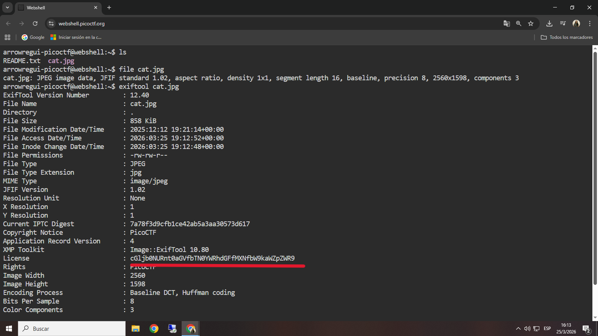
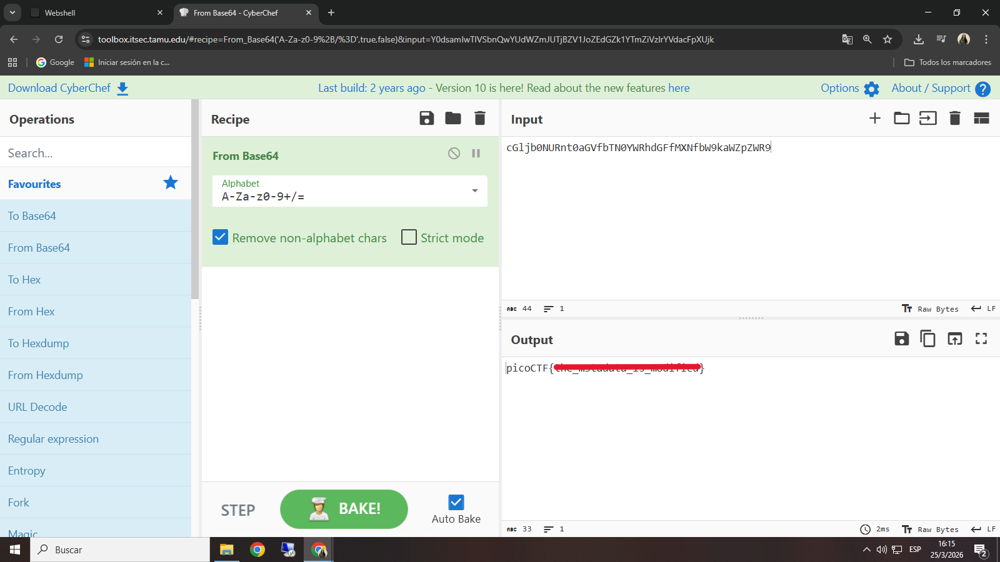

# Information

## **Descripción del Desafío**

**Nombre:** Information

**Categoría:** Forensics

**Objetivo:** Analizar un archivo de imagen para encontrar información oculta en sus metadatos y obtener la flag.

**Enunciado:**

Download this image file and find the flag.

## **Metodología**

### **Descarga del archivo**

Descargué el archivo proporcionado utilizando `wget`:

```bash
wget https://artifacts.picoctf.net/c/101/drawing.flag.svg
```

### **Identificación del tipo de archivo**

Verifiqué el tipo de archivo con:

```bash
file drawing.flag.svg
```

El resultado indicó que se trataba de un archivo SVG (imagen vectorial).

---

### **Análisis de metadatos**

Utilicé `exiftool` para inspeccionar los metadatos del archivo:

```bash
exiftool drawing.flag.svg
```

Durante el análisis, observé un campo de **licencia** con una cadena de caracteres inusual, lo que llamó mi atención.



---

### **Decodificación de la información**

Copié la cadena encontrada y la analicé utilizando CyberChef.

Aplicando una decodificación adecuada (por ejemplo, Base64), logré obtener la flag.



---

## **Herramientas Utilizadas**

- `wget` → Descarga de archivos
- `file` → Identificación del tipo de archivo
- `exiftool` → Análisis de metadatos
- `CyberChef` → Decodificación de datos

---

## **Aprendizajes Clave**

- Los metadatos pueden contener información sensible o pistas ocultas.
- Archivos aparentemente inofensivos (como imágenes) pueden ocultar datos importantes.
- Herramientas como `exiftool` son fundamentales en análisis forense.