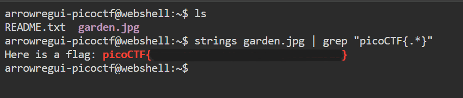

# **Glory of the Garden**

## **Descripción del Desafío**

**Nombre:** Glory of the Garden

**Categoría:** Forensics

**Objetivo:** Analizar un archivo de imagen para encontrar información oculta dentro de su contenido.

**Enunciado:**

This garden contains more than it seems.

## **Metodología**

### **Descarga del archivo**

Descargué la imagen proporcionada utilizando `wget`:

```bash
wget https://jupiter.challenges.picoctf.org/static/d0e1ffb10fc0017c6a82c57900f3ffe3/garden.jpg
```

---

### **Inspección inicial**

Intenté visualizar el contenido del archivo con:

```bash
cat garden.jpg
```

Sin embargo, al tratarse de un archivo binario, la salida contenía gran cantidad de caracteres ilegibles.

---

### **Extracción de texto relevante**

En lugar de revisar todo el contenido manualmente, utilicé `strings` para extraer texto legible del archivo.

Para reducir el ruido y encontrar directamente la flag, utilicé:

```bash
strings garden.jpg |grep -o "picoCTF{.*}"
```

Esto permitió filtrar únicamente la flag sin mostrar información innecesaria.



---

### **Obtención de la flag**

El comando anterior devolvió directamente la flag en el formato esperado.

---

## **Herramientas Utilizadas**

- `wget` → Descarga del archivo
- `cat` → Inspección inicial
- `strings` → Extracción de texto legible
- `grep` → Filtrado preciso de la información

---

## **Aprendizajes Clave**

- Los archivos binarios pueden contener información oculta accesible mediante herramientas adecuadas.
- `strings` combinado con `grep` permite encontrar datos relevantes de forma eficiente.
- Filtrar información es una habilidad clave en ciberseguridad, especialmente en análisis forense.