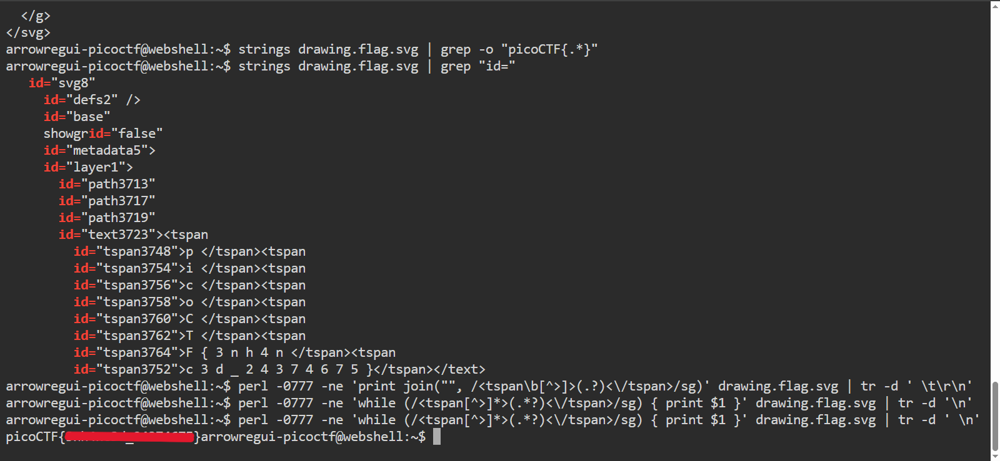

# Enhance!

## **Descripción del Desafío**

**Nombre:** Enhance!

**Categoría:** Forensics

**Objetivo:** Analizar un archivo SVG para reconstruir información oculta fragmentada y obtener la flag.

**Enunciado:**

Download this image file and find the flag.

---

## **Metodología**

### **Descarga del archivo**

Descargué el archivo utilizando `wget`:

```bash
wget https://artifacts.picoctf.net/c/101/drawing.flag.svg
```

---

### **Análisis inicial**

Primero analicé los metadatos con:

```bash
exiftool drawing.flag.svg
```

No encontré información relevante.

Luego inspeccioné el contenido del archivo:

```bash
cat drawing.flag.svg
```

Observé que el archivo estaba compuesto por múltiples etiquetas `<tspan>`, cada una conteniendo fragmentos de texto.

---

### **Identificación del problema**

La flag no estaba en una sola línea, sino distribuida en múltiples elementos `<tspan>`, lo que impedía visualizarla directamente.

Intenté un filtrado inicial con:

```bash
cat drawing.flag.svg |grep"id="
```

Sin embargo, esto no permitía reconstruir la flag completa.

---

### **Extracción de los fragmentos**

Para extraer el contenido de cada `<tspan>`, utilicé:

```bash
perl-0777-ne'while (/<tspan[^>]*>(.*?)<\/tspan>/sg) { print $1 }' drawing.flag.svg
```

Esto permitió obtener todos los fragmentos de texto, pero inicialmente aparecían separados por espacios y saltos de línea.

---

### **Limpieza y reconstrucción de la flag**

Para solucionar el problema y obtener la flag correctamente, eliminé los espacios y saltos de línea:

```bash
perl-0777-ne'while (/<tspan[^>]*>(.*?)<\/tspan>/sg) { print $1 }' drawing.flag.svg | tr-d' \n'
```

Esto permitió reconstruir la flag completa en una sola línea.



---

## **Herramientas Utilizadas**

- `wget` → Descarga del archivo
- `exiftool` → Análisis de metadatos
- `cat` → Inspección del contenido
- `grep` → Filtrado inicial
- `perl` → Extracción avanzada de datos
- `tr` → Limpieza del formato

---

## **Aprendizajes Clave**

- Los archivos SVG son texto estructurado (XML), por lo que pueden ocultar información en múltiples elementos.
- Los datos pueden estar fragmentados y requerir reconstrucción.
- No solo es importante extraer información (*parsing*), sino también limpiarla (*data cleaning*).