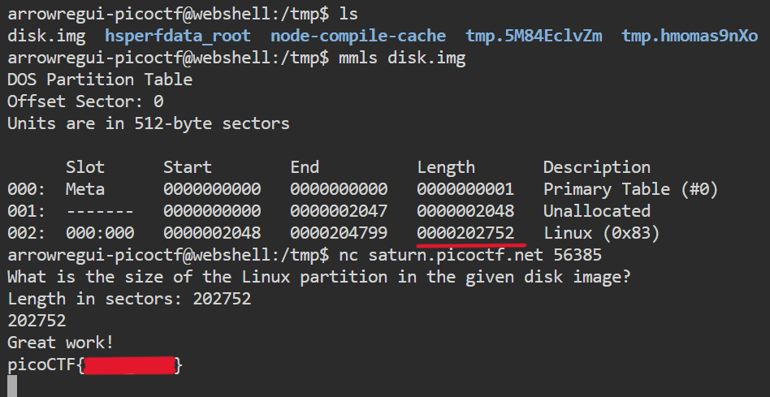

# **Sleuthkit Intro**

## **Descripción del Desafío**

**Nombre:** Sleuthkit Intro

**Categoría:** Forensics

**Objetivo:** Analizar una imagen de disco para identificar el tamaño de una partición utilizando herramientas forenses.

**Enunciado:**

Descarga la imagen de disco y usa `mmls` para determinar el tamaño de la partición de Linux. Conéctate al servicio de verificación remota para comprobar tu respuesta y obtener la bandera.

---

## **Metodología**

### **Descarga del archivo**

Siguiendo las indicaciones del desafío, descargué la imagen en el directorio `/tmp`:

```bash
cd /tmp
wget <url_del_archivo>
```

---

### **Identificación del archivo**

Verifiqué el tipo de archivo utilizando:

```bash
file <nombre_del_archivo>
```

El resultado indicó que se trataba de un archivo comprimido.

---

### **Descompresión**

Procedí a descomprimir el archivo:

```bash
gzip-d <nombre_del_archivo>
```

Esto generó la imagen de disco a analizar.

---

### **Análisis de la imagen de disco**

Utilicé la herramienta `mmls` (parte de The Sleuth Kit) para analizar la tabla de particiones:

```bash
mmls <nombre_de_la_imagen>
```

Este comando mostró información sobre las particiones, incluyendo su tamaño en sectores.

Identifiqué la partición correspondiente a Linux y anoté su longitud.

---

### **Validación de la respuesta**

Me conecté al servicio remoto utilizando `nc`:

```bash
nc saturn.picoctf.net55012
```

Ingresé el tamaño de la partición previamente obtenido, lo que permitió recibir la flag.



---

## **Herramientas Utilizadas**

- `wget` → Descarga del archivo
- `file` → Identificación del tipo de archivo
- `gzip` → Descompresión
- `mmls` → Análisis de particiones (The Sleuth Kit)
- `nc` (netcat) → Conexión a servicio remoto

---

## **Aprendizajes Clave**

- Las imágenes de disco pueden analizarse sin montarlas utilizando herramientas forenses.
- `mmls` permite visualizar la estructura de particiones y sus tamaños.
- Comprender sectores y particiones es fundamental en análisis forense digital.