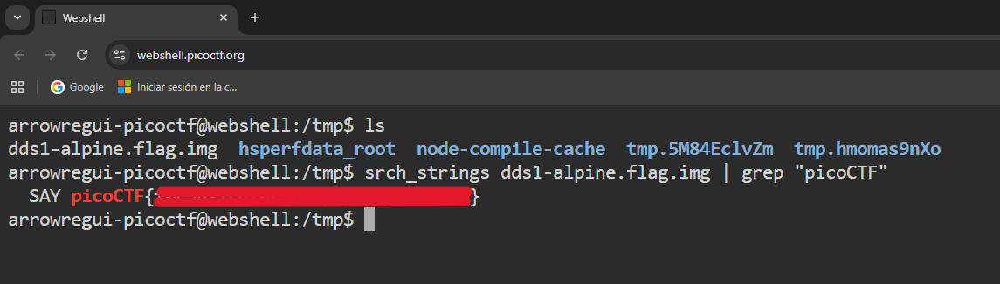

# Disk, disk, sleuth!

## **Descripción del Desafío**

**Nombre:** Disk, disk, sleuth!

**Categoría:** Forensics

**Objetivo:** Analizar una imagen de disco utilizando herramientas de Sleuth Kit para encontrar una flag oculta.

**Enunciado:**

Utiliza `srch_strings` de sleuthkit y algo de habilidad con la terminal para encontrar una bandera en esta imagen de disco: `dds1-alpine.flag.img.gz`

---

## **Metodología**

### **Descarga del archivo**

Descargué la imagen comprimida utilizando `wget`:

```bash
wget <url_del_archivo>
```

---

### **Identificación del archivo**

Verifiqué el tipo de archivo con:

```bash
file dds1-alpine.flag.img.gz
```

El resultado indicó que se trataba de un archivo comprimido con gzip.

---

### **Problema de espacio y solución**

Al intentar descomprimir el archivo en el directorio actual, obtuve un error por falta de espacio.

Para solucionarlo, cambié al directorio `/tmp`, que dispone de más espacio en la webshell:

```bash
cd /tmp
```

---

### **Descompresión del archivo**

Descomprimí la imagen utilizando:

```bash
gunzip dds1-alpine.flag.img.gz
```

Esto generó el archivo `dds1-alpine.flag.img`.

---

### **Búsqueda de la flag**

Utilicé la herramienta `srch_strings` de Sleuth Kit para extraer texto del archivo, combinada con `grep` para filtrar la flag:

```bash
srch_strings dds1-alpine.flag.img |grep"picoCTF"
```

Esto permitió encontrar directamente la flag dentro del contenido de la imagen.



---

## **Herramientas Utilizadas**

- `wget` → Descarga del archivo
- `file` → Identificación del tipo
- `gunzip` → Descompresión
- `srch_strings` → Extracción de texto en imágenes de disco
- `grep` → Filtrado de resultados

---

## **Aprendizajes Clave**

- Las imágenes de disco pueden contener texto recuperable sin necesidad de montarlas.
- `srch_strings` es similar a `strings`, pero optimizado para análisis forense.
- Gestionar el espacio en disco es importante en entornos limitados como webshells.