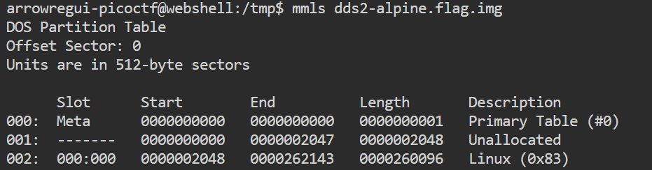
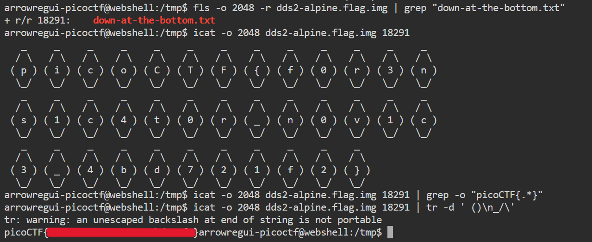

# **Disk, disk, sleuth! II**

## **Descripción del Desafío**

**Nombre:** Disk, disk, sleuth! II

**Categoría:** Forensics

**Objetivo:** Encontrar un archivo específico dentro de una imagen de disco y extraer su contenido para obtener la flag.

**Enunciado:**

All we know is the file with the flag is named `down-at-the-bottom.txt`...

---

## **Metodología**

### **Descarga del archivo**

Descargué la imagen comprimida utilizando `wget`:

```bash
wget <url_del_archivo>
```

---

### **Identificación y descompresión**

Verifiqué el tipo de archivo:

```bash
file dds2-alpine.flag.img.gz
```

Luego descomprimí el archivo (utilizando `/tmp` por espacio si era necesario):

```bash
cd /tmp
gunzip dds2-alpine.flag.img.gz
```

Esto generó la imagen `dds2-alpine.flag.img`.

---

### **Problema al analizar la imagen**

Intenté listar los archivos con:

```bash
fls dds2-alpine.flag.img
```

Pero obtuve el error:

```bash
Cannot determine file system type
```

Esto indicaba que la imagen contenía una tabla de particiones y no un filesystem directo.

---

### **Análisis de particiones**

Para resolverlo, utilicé:

```bash
mmls dds2-alpine.flag.img
```

Esto mostró las particiones disponibles. Identifiqué la partición Linux y anoté su **offset** (por ejemplo: `2048`).



---

### **Búsqueda del archivo**

Con el offset, listé los archivos correctamente:

```bash
fls -o 2048 -r dds2-alpine.flag.img | grep "down-at-the-bottom.txt"
```

Esto devolvió el archivo junto con su **inode**, por ejemplo:

```bash
r/r128: down-at-the-bottom.txt
```

---

### **Extracción del archivo**

Intenté ejecutar:

```bash
icat -o 2048 dds2-alpine.flag.img <inode>
```

Pero obtuve el error:

```bash
-bash: syntax error near unexpected token `newline'
```

Esto ocurrió porque `<inode>` no debe escribirse literalmente, sino reemplazarse por el número real.

Finalmente ejecuté:

```bash
icat -o 2048 dds2-alpine.flag.img 18291
```

El resultado mostró el contenido del archivo, pero la flag aparecía separada en múltiples caracteres (formato ASCII-art).

---

### **Reconstrucción de la flag**

Para obtener la flag correctamente, filtré la salida utilizando:

```bash
icat -o 2048 dds2-alpine.flag.img 18291 | grep -o "picoCTF{.*}"
```

Esto permitió extraer la flag en una sola línea y sin ruido.



---

## **Herramientas Utilizadas**

- `wget` → Descarga del archivo
- `file` → Identificación del tipo
- `gunzip` → Descompresión
- `mmls` → Análisis de particiones
- `fls` → Listado de archivos
- `icat` → Extracción de archivos
- `grep` → Filtrado de resultados

---

## **Aprendizajes Clave**

- Las imágenes de disco pueden contener particiones, por lo que es necesario identificar el offset antes de analizarlas.
- `mmls` permite visualizar la estructura de particiones.
- `fls` y `icat` trabajan con inodes en lugar de nombres de archivo.
- La información extraída puede requerir procesamiento adicional para obtener resultados útiles.