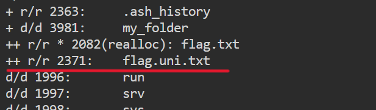
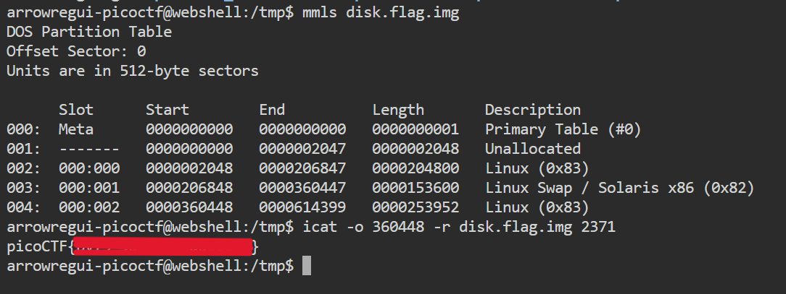

# **Sleuthkit Apprentice**

## **Descripción del Desafío**

**Nombre:** Sleuthkit Apprentice

**Categoría:** Forensics

**Objetivo:** Explorar una imagen de disco para identificar archivos relevantes y obtener la flag.

**Enunciado:**

Download this disk image and find the flag.

Note: if you are using the webshell, download and extract the disk image into `/tmp` not your home directory.

---

## **Metodología**

### **Descarga del archivo**

Descargué la imagen comprimida utilizando `wget` en el directorio `/tmp`:

```bash
cd /tmp
wget <url_del_archivo>
```

---

### **Identificación y descompresión**

Verifiqué el tipo de archivo:

```bash
file <nombre_del_archivo>
```

Luego lo descomprimí:

```bash
gunzip <nombre_del_archivo>
```

Esto generó la imagen de disco.

---

### **Análisis de particiones**

Utilicé `mmls` para identificar las particiones:

```bash
mmls <nombre_de_la_imagen>
```

Identifiqué la partición Linux y anoté su **offset** (por ejemplo: `2048`).

---

### **Exploración del sistema de archivos**

A diferencia de desafíos anteriores, no se proporcionaba el nombre del archivo con la flag, por lo que fue necesario explorar manualmente.

Listé los archivos de forma recursiva:

```bash
fls -o 360448 -r <nombre_de_la_imagen>
```

Revisando la salida, identifiqué un archivo sospechoso con nombre relacionado a “flag”.



---

### **Extracción del archivo**

Obtuve el inode del archivo y utilicé `icat` para visualizar su contenido:

```bash
icat -o 360448 <nombre_de_la_imagen> 2371
```

El contenido del archivo incluía la flag.



---

## **Herramientas Utilizadas**

- `wget` → Descarga del archivo
- `file` → Identificación del tipo
- `gunzip` → Descompresión
- `mmls` → Análisis de particiones
- `fls` → Exploración del sistema de archivos
- `icat` → Extracción de archivos

---

## **Aprendizajes Clave**

- Cuando no se conoce el nombre del archivo, es necesario explorar el sistema de archivos manualmente.
- `fls -r` permite realizar enumeración completa de archivos.
- Identificar archivos relevantes por nombre es una técnica útil en análisis forense.