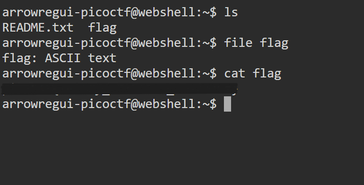

# Obedient Cat

## **Descripción del Desafío**

* **Nombre:** Obedient Cat.
* **Link del reto** [link](https://play.picoctf.org/playlists/14?m=94).
* **Categoría:** General Skills in CTF's.
* **Objetivo:** Resolver un desafío introductorio aplicando técnicas básicas de reconocimiento, análisis de pistas y uso de comandos simples.
* **Enunciado:** Este archivo tiene una bandera visible (también conocida como "in-the-clear"). Y descarga la [flag](https://mercury.picoctf.net/static/fb851c1858cc762bd4eed569013d7f00/flag).

## Metodología

1. **Descarga del archivo:**
   En la terminal de picoCTF, utilicé `wget` para descargar el archivo:

   ```bash
   wget https://artifacts.picoctf.net/c/123/obedient_cat.txt
   ```

2. **Listar archivos del directorio:**
   Esto me permitió ver todos los archivos presentes en el directorio.

   ```bash
   ls
   ```


3. **Identificación del tipo de archivo:**
   Así determiné que el archivo era de tipo ASCII, y por lo tanto podía leerlo como texto plano.

   ```bash
   file flag
   ```


4. **Lectura del contenido del archivo:**

   ```bash
   cat flag
   ```

5. **Flag encontrada:**
   Dentro del archivo se encontraba la bandera en el formato estándar de picoCTF.

## Herramientas Utilizadas

* Terminal online de picoCTF (Webshell)
* Comandos básicos: `ls`, `file`, `cat`

## Aprendizajes Clave

* Importancia de inspeccionar los archivos y entender su tipo antes de abrirlos.
* Reforzamiento del flujo básico para encontrar banderas: descargar → listar → identificar tipo → leer → registrar.
* Familiarización con comandos de Bash básicos en el contexto de CTFs.

## Captura de pantalla

