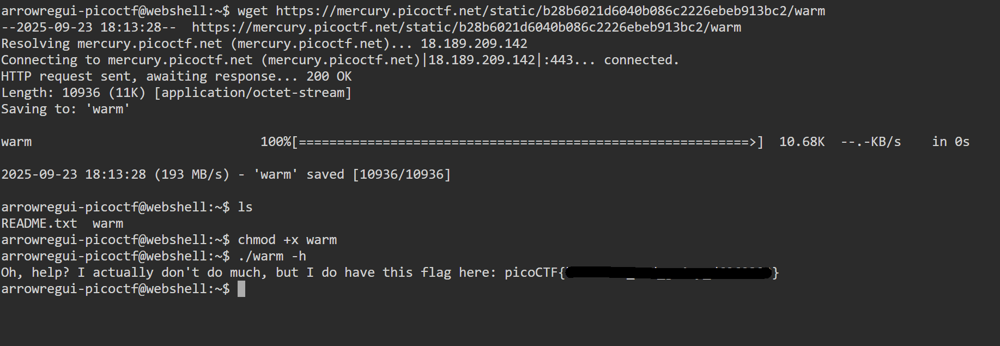

# Wave a flag

## **Descripción del Desafío**

* **Nombre:** Wave a flag.
* **Link del reto** [link](https://play.picoctf.org/playlists/14?m=95).
* **Categoría:** General Skills in CTF's.
* **Objetivo:** Resolver un desafío introductorio aplicando técnicas básicas de reconocimiento, análisis de pistas y uso de comandos simples.
* **Enunciado:** ¿Se pueden invocar indicadores de ayuda para una herramienta o un binario? Este [programa](https://mercury.picoctf.net/static/b28b6021d6040b086c2226ebeb913bc2/warm) contiene información muy útil...

## Metodología

1. **Descarga del archivo:**
   En la terminal de picoCTF, utilicé `wget` para descargar el archivo:

   ```bash
   wget https://mercury.picoctf.net/static/b28b6021d6040b086c2226ebeb913bc2/warm
   ```

2. **Listar archivos del directorio:**

   ```bash
   ls
   ```

   Esto me permitió ver los archivos presentes en el directorio.

3. **Convertir en ejecutable el archivo:**

   ```bash
   chmod +x warm
   ```

4. **Ejecutar el archivo:**

    ```bash
    ./warm
    ```
    Esto me permitió visualizar la información proporcionada por el programa, útil para resolver el desafío.

## Herramientas Utilizadas

* Terminal online de picoCTF (Webshell)
* Comandos básicos: `ls`, `chmod +x`.

## Aprendizajes Clave

* Volver ejecutable los archivos para poder acceder a ellos.

## Captura de pantalla

<p align="center">
  <br>
</p>