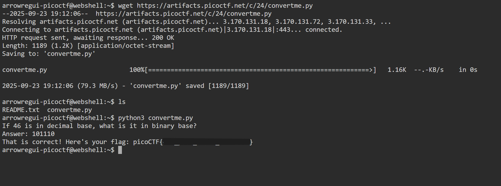

# Convertme.py

## **Descripción del Desafío**

* **Nombre:** Convertme.py.
* **Link del reto** [link](https://play.picoctf.org/playlists/14?m=96).
* **Categoría:** General Skills in CTF's.
* **Objetivo:** Resolver un desafío introductorio aplicando técnicas básicas de reconocimiento, análisis de pistas y uso de comandos simples.
* **Enunciado:** Ejecute el script de Python y convierta el número dado de decimal a binario para obtener la bandera.
[Descargar script de Python](https://artifacts.picoctf.net/c/24/convertme.py)

## Metodología

1. **Descarga del archivo:**
   En la terminal de picoCTF, utilicé `wget` para descargar el archivo:

   ```bash
   wget https://artifacts.picoctf.net/c/24/convertme.py
   ```

2. **Listar archivos del directorio:**
   Esto me permitió ver los archivos presentes en el directorio.

   ```bash
   ls
   ```


3. **Abrir archivo .py:**
   Esto me permitió visualizar el número decimal que debía convertir.

   ```bash
   python3 convertme.py
   ```


4. **Convertir número decimal a binario para obtener la flag:**
   Utilicé un convertidor online para transformar el número y obtener la bandera en el formato estándar de picoCTF.

5. **Obtener la flag:**  
   Una vez convertido el número decimal a binario, se obtuvo la bandera en el formato estándar de picoCTF.

## Herramientas Utilizadas

* Terminal online de picoCTF (Webshell)
* Comandos: ls, python3 convertme.py
* Convertidor online de decimal a binario

## Aprendizajes Clave

* Cómo ejecutar un script de Python para interactuar con un reto.
* Cómo convertir números de decimal a binario para resolver desafíos.

## Captura de pantalla

