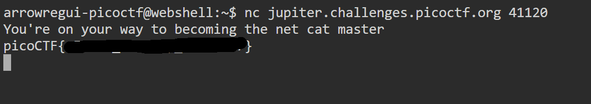

# What's a net cat?

## **Descripción del Desafío**

* **Nombre:** What's a net cat?.
* **Link del reto** [link](https://play.picoctf.org/playlists/14?m=97).
* **Categoría:** General Skills in CTF's.
* **Objetivo:** Resolver un desafío introductorio aplicando técnicas básicas de reconocimiento, análisis de pistas y uso de comandos simples.
* **Enunciado:** Usar netcat (nc) será muy importante. ¿Puedes conectarte a `jupiter.challenges.picoctf.org` en el puerto `41120` para obtener la bandera?

## Metodología

1. **Descarga del archivo:**
   En la terminal de picoCTF, utilicé `nc` para conectarme al servidor indicado:

   ```bash
   nc jupiter.challenges.picoctf.org 41120
   ```

2. **Obtener la flag:**  
   Una vez establecida la conexión se obtuvo la bandera en el formato estándar de picoCTF.

## Herramientas Utilizadas

* Terminal online de picoCTF (Webshell)
* Comandos: `nc`.

## Aprendizajes Clave

* Cómo conectarse a un puerto remoto usando netcat.
* Comprender la utilidad de netcat para transferir información y obtener datos de servicios en red.

## Captura de pantalla

