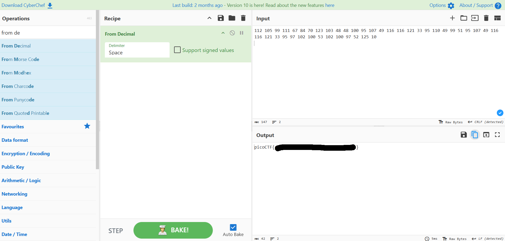

# Nice netcat

## **Descripción del Desafío**

* **Nombre:** Nice netcat.
* **Link del reto** [link](https://play.picoctf.org/playlists/14?m=98).
* **Categoría:** General Skills in CTF's.
* **Objetivo:** Resolver un desafío introductorio aplicando técnicas básicas de reconocimiento, análisis de pistas y uso de comandos simples.
* **Enunciado:** Hay un programa muy bueno con el que puedes comunicarte usando este comando en un shell: $ nc mercury.picoctf.net 21135, pero no habla inglés...

## Metodología

1. **Descarga del archivo:**
   En la terminal de picoCTF, utilicé `nc` para conectarme al servidor indicado:

   ```bash
   nc mercury.picoctf.net 21135
   ```

2. **Obtener número decimal:**  
   Una vez establecida la conexión, el programa devolvió una serie de números decimales.

3. **Convertir números a texto:**
   Utilicé CyberChef para convertir los números decimales a ASCII, lo que permitió obtener la bandera en formato picoCTF.

## Herramientas Utilizadas

* Terminal online de picoCTF (Webshell).
* Comandos: `nc`.
* Herramienta en línea de conversión de decimal a ASCII (Cyberchef).

## Aprendizajes Clave

* Cómo conectarse a un puerto remoto usando netcat.
* Cómo interpretar números decimales y convertirlos a texto.
* Uso de herramientas en línea como CyberChef para procesar datos.

## Captura de pantalla

