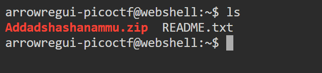
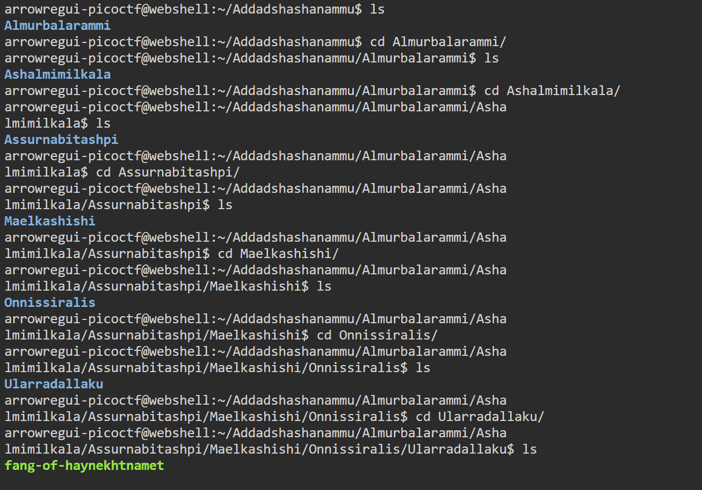

# Tab, Tab, Attack

## **Descripción del Desafío**

* **Nombre:** Tab, Tab, Attack.
* **Link del reto** [link](https://play.picoctf.org/playlists/14?m=99).
* **Categoría:** General Skills in CTF's.
* **Objetivo:** Resolver un desafío introductorio aplicando técnicas básicas de reconocimiento, análisis de pistas y uso de comandos simples.
* **Enunciado:** El uso de tabcomplete en la Terminal le agregará años a su vida, especialmente cuando se trata de estructuras de directorios y nombres de archivos largos y confusos: [Addadshashanammu.zip](https://mercury.picoctf.net/static/3afd18a65e42b80526aa87f9766c588b/Addadshashanammu.zip)

## Metodología

1. **Descargué del archivo:**
   En la terminal de picoCTF, utilicé `wget` para descargar los archivos dados:

   ```bash
   wget https://mercury.picoctf.net/static/3afd18a65e42b80526aa87f9766c588b/Addadshashanammu.zip
   ```

2. **Comprobé que el archivo se haya descargado:**  
   Utilicé el comando `ls` para comprobar que el archivo esté descargado.

   ```bash
    ls
   ```
   

3. **Descomprimí el archivo .zip:**
   Utilicé el comando `unzip` para descomprimir el archivo.

   ```bash
   unzip Addadshashanammu.zip
   ```

4. **Entrar al directorio:**
    El archivo zip creó un directorio con un nombre largo. Utilicé Tab Completion para navegar rápidamente sin escribir todo el nombre:

   ```bash
   cd Addadshashanammu
   ```

5. **Exploración de archivos**
   Dentro del directorio, listé los archivos y usé Tab para autocompletar los nombres de los archivos largos:

    ```bash
    ls
    cd <nombre del archivo>
    ```
    Este paso permite abrir el archivo que contiene la flag.

6. **Flag encontrada**
    Al abrir el archivo correspondiente, se encontró la flag en formato picoCTF{...}.

## Herramientas Utilizadas

* Terminal online de picoCTF (Webshell).
* Comandos: `wget`, `ls`, `unzip`, `cd`, `cat`.

## Aprendizajes Clave

* Cómo usar Tab Completion para navegar rápidamente directorios y archivos con nombres complicados.
* Extraer y explorar archivos .zip en la terminal.

## Captura de pantalla

