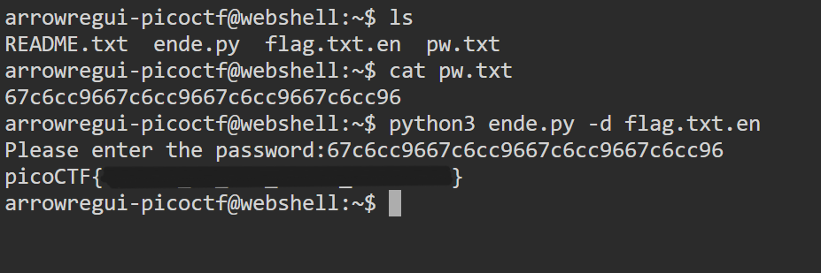

# Python Wrangling

## **Descripción del Desafío**

* **Nombre:** Python Wrangling.
* **Link del reto** [link](https://play.picoctf.org/playlists/14?m=100).
* **Categoría:** General Skills in CTF's.
* **Objetivo:** Resolver un desafío introductorio aplicando técnicas básicas de reconocimiento, análisis de pistas y uso de comandos simples.
* **Enunciado:** Los scripts de Python se invocan de forma similar a los programas en la Terminal... ¿Puedes ejecutar este script de [Python](https://mercury.picoctf.net/static/b351a89e0bc6745b00716849105f87c6/ende.py) usando esta [contraseña](https://mercury.picoctf.net/static/b351a89e0bc6745b00716849105f87c6/pw.txt) para obtener la [bandera](https://mercury.picoctf.net/static/b351a89e0bc6745b00716849105f87c6/flag.txt.en)?

## Metodología

1. **Descarga del archivo:**
   En la terminal de picoCTF, utilicé `wget` para descargar los archivos dados:

   ```bash
   wget https://mercury.picoctf.net/static/b351a89e0bc6745b00716849105f87c6/ende.py

   wget https://mercury.picoctf.net/static/b351a89e0bc6745b00716849105f87c6/pw.txt

   wget https://mercury.picoctf.net/static/b351a89e0bc6745b00716849105f87c6/flag.txt.en
   ```

2. **Abrí el archivo de la contraseña para obtenerla:**  
   Utilicé el comando `cat` para poder obtener la contraseña que se usará para decoficar el archivo.

   ```bash
   cat pw.txt
   ```

3. **Abrí el archivo python codificado:**
   Ejecuté el script con Python 3 indicando la opción -d para decodificar:

   ```bash
   python3 ende.py -d flag.txt.en
   ```

4. **Ingresé la contraseña dada:**
   El script pedirá la contraseña por teclado. Ingrésala y pulsa Enter.

5. **Flag encontrada**
   Tras introducir la contraseña, el script descifra flag.txt.en y muestra la flag en formato picoCTF{...}.

## Herramientas Utilizadas

* Terminal online de picoCTF (Webshell).
* Comandos: `cat` `python3` `wget`.

## Aprendizajes Clave

* Cómo ejecutar scripts con python3.
* Cómo usar un script provisto para decodificar un archivo cifrado con una contraseña..

## Captura de pantalla

