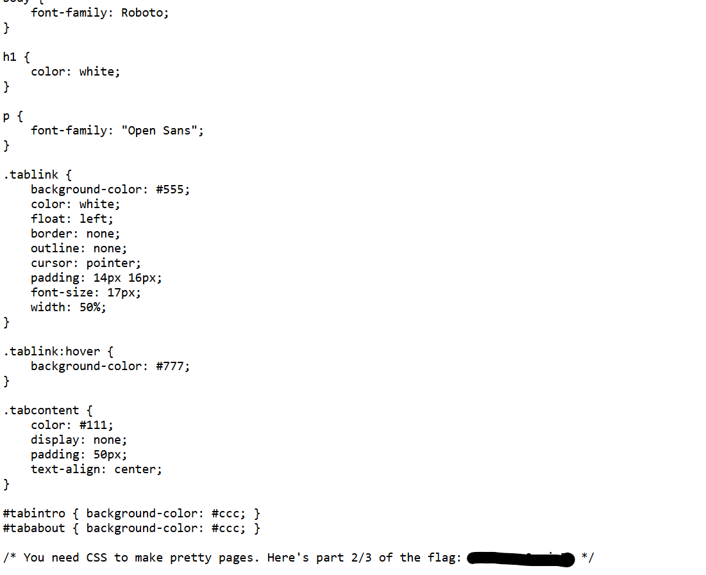
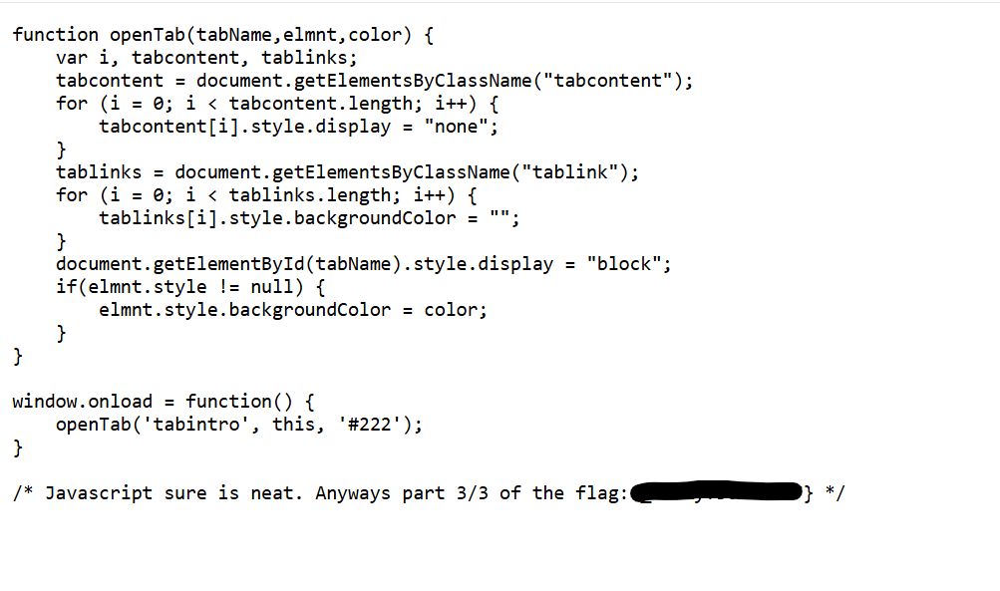

# Insp3ct0r

## **Descripción del Desafío**

* **Nombre:** Insp3ct0r.
* **Link del reto:** [link](https://play.picoctf.org/practice/challenge/18)
* **Categoría:** Web Exploitation.
* **Objetivo:** Encontrar las tres partes de una bandera escondidas en los diferentes lenguajes que componen una página web.
* **Enunciado:** Kishor Balan nos dio un soplo de que el siguiente código puede necesitar inspección: [http://fickle-tempest.picoctf.net:62495](http://fickle-tempest.picoctf.net:62495)

## Metodología

1. **Inspección del HTML:**
   Accedí al código fuente del sitio (`Ctrl + U`). Al revisar el archivo principal, encontré la primera parte de la flag en un comentario al final del documento.
   * **Parte 1/3:** 
   

2. **Inspección del CSS:**
   Busqué en el HTML la etiqueta `<link>` que llamaba al archivo de estilos. Abrí `mycss.css` y encontré la segunda parte comentada al final del archivo.
   * **Parte 2/3:**
   

3. **Inspección del JavaScript:**
   Regresé al código fuente y localicé el archivo de script `myjs.js`. Al abrirlo, encontré la tercera y última parte de la flag.
   * **Parte 3/3:**
   

4. **Construcción de la Flag:**
   Uní las tres partes obtenidas para completar el formato requerido.

## Herramientas Utilizadas

* Herramientas de desarrollador del navegador (F12 / Inspector de elementos).
* Navegador Web (Chrome/Firefox).

## Aprendizajes Clave

* Las aplicaciones web suelen dividir su lógica en tres capas: HTML (estructura), CSS (estilo) y JS (interactividad).
* Nunca se debe dejar información sensible o partes de credenciales en comentarios dentro del código del lado del cliente (front-end).

