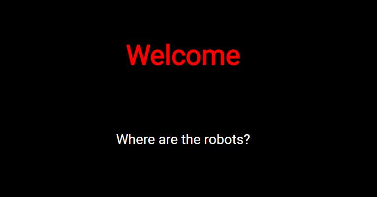
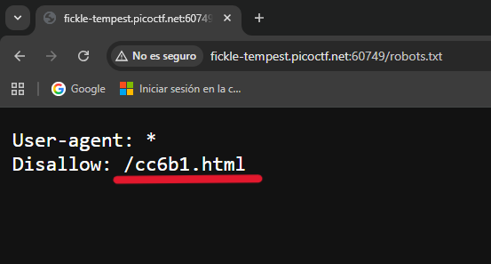
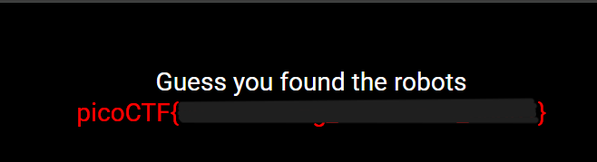

# Where are the robots

## **Descripción del Desafío**

**Nombre:** Where are the robots

**Categoría:** Web Exploitation

**Objetivo:** Encontrar recursos ocultos dentro de una aplicación web para obtener la flag.

**Enunciado:**

Can you find the robots?

[http://fickle-tempest.picoctf.net:60749](http://fickle-tempest.picoctf.net:60749/)

## **Metodología**

### **Acceso a la instancia**

Inicié la instancia del challenge, lo que me proporcionó una URL para acceder a la aplicación web.

Al ingresar al sitio, no se observaba información relevante a simple vista.



### **Inspección inicial**

Utilicé las herramientas de desarrollador del navegador (F12) para inspeccionar el HTML, pero no encontré información útil ni pistas visibles.

Esto indicaba que la flag probablemente no estaba en el código fuente directo.

### **Búsqueda de rutas ocultas**

Investigando posibles ubicaciones comunes de archivos ocultos en aplicaciones web, identifiqué el archivo estándar:

```bash
/robots.txt
```

Accedí manualmente desde el navegador:

```bash
http://fickle-tempest.picoctf.net:60749/robots.txt
```

### **Análisis de robots.txt**

Dentro del archivo encontré una directiva:

```bash
Disallow: /<ruta_oculta>
```

Esta directiva indica rutas que los bots (como los de buscadores) no deberían indexar, pero que siguen siendo accesibles manualmente.



---

### **Acceso a la ruta oculta**

Copié la ruta indicada en `Disallow` y la agregué a la URL base del sitio.

Al acceder a esa ruta, encontré directamente la flag.



---

## **Herramientas Utilizadas**

- Navegador web
- Herramientas de desarrollador (F12)
- Conocimiento de rutas comunes en aplicaciones web

---

## **Aprendizajes Clave**

- El archivo `robots.txt` puede revelar rutas sensibles u ocultas.
- “Oculto” no significa “seguro” → si está en el cliente, se puede acceder.
- Enumerar rutas comunes es una técnica básica pero muy poderosa en pentesting.