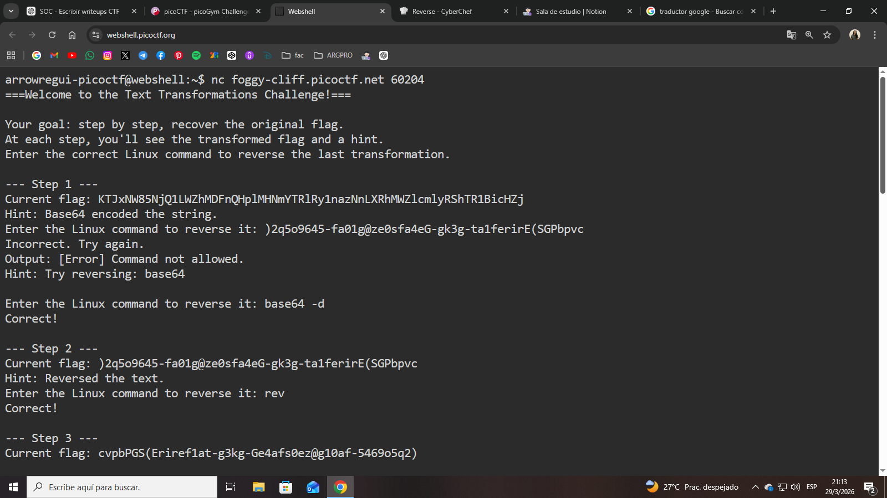
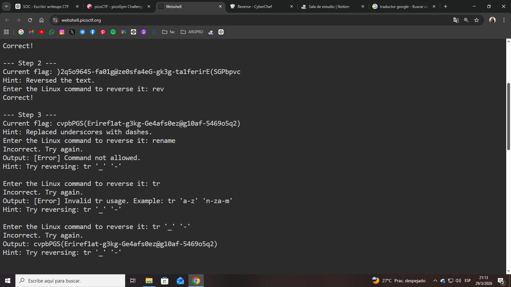
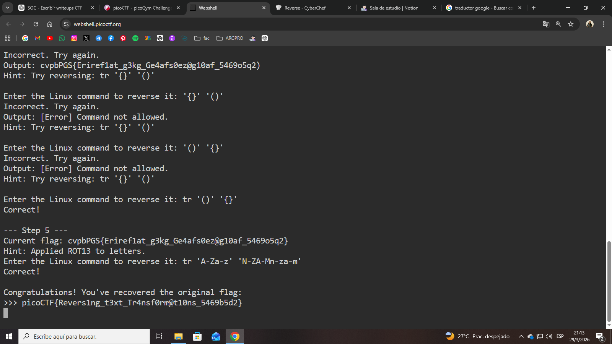

# **Text Transformations**

# **Descripción del Desafío**

**Nombre:** Text Transformations

**Categoría:** General Skills

**Objetivo:** Revertir una serie de transformaciones aplicadas a una cadena para recuperar la flag original.

**Enunciado:**

Se proporciona una cadena transformada en múltiples pasos. En cada etapa, se debe ingresar el comando de Linux correcto para revertir la transformación aplicada.

---

## **Metodología**

### **Conexión al servicio**

Me conecté al servidor remoto utilizando `nc`:

```bash
nc foggy-cliff.picoctf.net60204
```



---

### **Paso 1: Decodificación Base64**

El primer hint indicaba que la cadena estaba codificada en Base64.

Utilicé:

```bash
base64-d
```

Esto devolvió una cadena parcialmente legible.



---

### **Paso 2: Texto invertido**

El siguiente paso indicaba que el texto estaba invertido.

Utilicé:

```bash
rev
```

Esto revirtió correctamente la cadena.

---

### **Paso 3: Reemplazo de caracteres**

El hint indicaba que se habían reemplazado guiones bajos (`_`) por guiones (`-`).

Inicialmente intenté varios comandos incorrectos (`tr '_' '-'`, `sed`, etc.), hasta entender que debía aplicar la transformación inversa.

Finalmente utilicé:

```bash
tr'-''_'
```

Esto restauró los caracteres originales.

---

### **aso 4: Reemplazo de paréntesis**

El siguiente hint indicaba que se habían reemplazado llaves `{}` por paréntesis `()`.

Para revertirlo, utilicé:

```bash
tr'()''{}'
```

Esto devolvió la estructura correcta de la flag.

---

### **Paso 5: ROT13**

El último paso indicaba que se había aplicado ROT13.

Utilicé:

```bash
tr'A-Za-z''N-ZA-Mn-za-m'
```

Esto reveló la flag final.

---

## **Flag obtenida**



## **Herramientas Utilizadas**

- `nc` → Conexión remota
- `base64` → Decodificación
- `rev` → Inversión de texto
- `tr` → Reemplazo de caracteres

---

## **Aprendizajes Clave**

- Muchas transformaciones comunes pueden revertirse con herramientas básicas de Linux.
- Es importante interpretar correctamente los hints y aplicar la transformación inversa.
- El comando `tr` es fundamental para sustituciones de caracteres.
- ROT13 es una técnica de cifrado simple pero frecuente en CTF.